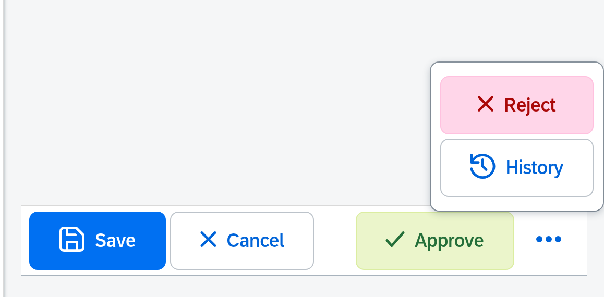

# UI5 Library `ui5.touch.controls`

**Standard OpenUI5 controls, rebuilt for touch — and finally resizable.**

`sap.m` controls are made for mouse and keyboard. On a tablet, a shop floor terminal or a device operated with gloves they are simply too small — and the cozy content density only gets you one step further. This library rebuilds the most important `sap.m` controls on their original structure and opens them up for sizing through one central `size` property (`S`–`6XL`) that works the same way on every control.

**You do not have to rebuild your app.** The controls keep the familiar properties, aggregations and events of their `sap.m` originals for the common cases, so you can use them as a drop-in replacement — add the namespace, put `tc:` in front of the control, set a size. Everything else stays the way it is.


**Live demo:** https://mariokernich.github.io/ui5-touch-controls/test-resources/ui5/touch/controls/Button.html

**npm package:** https://www.npmjs.com/package/ui5.touch.controls

## Drop-in replacement — before and after

A `sap.m.Page` with an `OverflowToolbar` as footer. This is the standard version:

```xml
<mvc:View
	xmlns:mvc="sap.ui.core.mvc"
	xmlns="sap.m">
	<Page title="Order">
		<footer>
			<OverflowToolbar>
				<Button text="Save" type="Emphasized" icon="sap-icon://save" press=".onSave" />
				<Button text="Cancel" icon="sap-icon://decline" press=".onCancel" />
				<ToolbarSpacer />
				<Button text="Approve" type="Accept" icon="sap-icon://accept" press=".onApprove" />
				<Button text="Reject" type="Reject" icon="sap-icon://decline" press=".onReject" />
				<Button text="History" icon="sap-icon://history" press=".onHistory" />
			</OverflowToolbar>
		</footer>
	</Page>
</mvc:View>
```

And the touch version — the namespace `tc`, a `tc:` in front of the controls and a `size`:

```xml
<mvc:View
	xmlns:mvc="sap.ui.core.mvc"
	xmlns="sap.m"
	xmlns:tc="ui5.touch.controls">
	<Page title="Order">
		<footer>
			<tc:OverflowToolbar size="XL">
				<tc:Button text="Save" type="Emphasized" icon="sap-icon://save" size="XL" press=".onSave" />
				<tc:Button text="Cancel" icon="sap-icon://decline" size="XL" press=".onCancel" />
				<ToolbarSpacer />
				<tc:Button text="Approve" type="Accept" icon="sap-icon://accept" size="XL" press=".onApprove" />
				<tc:Button text="Reject" type="Reject" icon="sap-icon://decline" size="XL" press=".onReject" />
				<tc:Button text="History" icon="sap-icon://history" size="XL" press=".onHistory" />
			</tc:OverflowToolbar>
		</footer>
	</Page>
</mvc:View>
```

Same aggregations, same properties, same event handlers — `press=".onSave"` still calls the same method in your controller. `sap.m` controls such as `ToolbarSpacer` can stay exactly where they are.

The result: buttons big enough to hit with a finger, and a toolbar that moves everything that does not fit behind a button with three dots.



Bind `size` to a model to switch the size of the whole app at runtime:

```xml
<tc:Button text="Save" size="{settings>/touchSize}" press=".onSave" />
```

## Requirements

- UI5 version **1.118 or higher** (OpenUI5 or SAPUI5)

## Installation

The library is published on npm as [`ui5.touch.controls`](https://www.npmjs.com/package/ui5.touch.controls) and can be consumed in any UI5 application that is built with the [UI5 Tooling](https://sap.github.io/ui5-tooling/) (v3 or higher).

### 1. Install the package

Install the library as a **regular dependency** (not a `devDependency`) so the UI5 Tooling picks it up as a project dependency:

```sh
npm install ui5.touch.controls
```

```json
{
	"dependencies": {
		"ui5.touch.controls": "^1.1.0"
	}
}
```

The package ships a `ui5.yaml`, so the UI5 Tooling automatically resolves it as a library dependency.

#### With UI5 middleware (alternative setup)

Instead of consuming the library as a UI5 Tooling project dependency, you can serve it statically with [`ui5-middleware-servestatic`](https://www.npmjs.com/package/ui5-middleware-servestatic):

```sh
npm i ui5.touch.controls && npm i -D ui5-middleware-servestatic
```

Add the following configuration to your `ui5.yaml`:

```yaml
server:
  customMiddleware:
    - name: ui5-middleware-servestatic
      afterMiddleware: compression
      mountPath: /resources/ui5/touch/controls/
      configuration:
        npmPackagePath: 'ui5.touch.controls/dist/resources/ui5/touch/controls'
```

### 2. Declare the library in `manifest.json`

Add the library to the dependencies of your app:

```json
{
	"sap.ui5": {
		"dependencies": {
			"libs": {
				"ui5.touch.controls": {}
			}
		}
	}
}
```

### 3. Add the namespace to your views

```xml
<mvc:View
	xmlns:mvc="sap.ui.core.mvc"
	xmlns="sap.m"
	xmlns:tc="ui5.touch.controls">
	<tc:Button text="Hello" size="XL" />
</mvc:View>
```

### TypeScript support

For TypeScript projects, add the package to the `types` entry in your `tsconfig.json` — otherwise the UI5 Tooling will not load the library automatically:

```json
{
	"compilerOptions": {
		"types": [
			"@sapui5/types",
			"ui5.touch.controls"
		]
	}
}
```

The package includes TypeScript type definitions (`dist/index.d.ts`), so you get full typing out of the box:

```ts
import Button from "ui5/touch/controls/Button";
import { SizeMode } from "ui5/touch/controls/library";

const button = new Button({ text: "Confirm", size: SizeMode.XL });
```

## Controls

| Control | Replaces | Description |
| --- | --- | --- |
| `tc:Button` | `sap.m.Button` | Button with configurable size, icon, icon position, type (all `sap.m.ButtonType` values), side padding and width. Fires `press`. |
| `tc:SegmentedButton` | `sap.m.SegmentedButton` | A row of joined buttons of which exactly one is selected, filled through `tc:SegmentedButtonItem` (`key`, `text`, `icon`, `enabled`). Supports `selectedKey`, `width` for evenly spread segments and fires `selectionChange`. |
| `tc:Input` | `sap.m.Input` | Single-line input with configurable size. |
| `tc:TextArea` | `sap.m.TextArea` | Multi-line input with configurable size, rows, max length and value states. Fires `change` / `liveChange`. |
| `tc:Text` | `sap.m.Text` | Text with configurable size and color. Fires `press`. |
| `tc:Toolbar` | `sap.m.Toolbar` | Toolbar container with a `content` aggregation. Usable in standard aggregations such as the footer of a `Page` or `Dialog`. |
| `tc:OverflowToolbar` | `sap.m.OverflowToolbar` | Like `tc:Toolbar`, but content that does not fit into the available width is moved behind a button with three dots which opens a popover with the remaining content. Understands the priorities of `sap.m.OverflowToolbarLayoutData`. |
| `tc:StepInput` | `sap.m.StepInput` | Minus button, input and plus button, sized together. Supports `min`, `max`, `step`. Fires `change`. |
| `tc:VirtualKeyboard` | – | On-screen keyboard built from the library's own buttons, with configurable layout (incl. `{shift}`, `{space}`, `{bksp}`, `{enter}`), optional hardware key input, value binding and `change` / `keyPress` / `enter` events. |
| `QuickDialog` | `sap.m.MessageBox` | Helper class for touch-ready dialogs, used from the controller instead of a view: `show`, `confirm`, `information`, `error`, `input`, `select`, `details`. Every method returns a `Promise`. |

### Sizes

Every control has the same `size` property. Available values:

`S` · `M` (default) · `L` · `XL` · `2XL` · `3XL` · `4XL` · `5XL` · `6XL`

The size scales font size, icon size, padding and height together, so the controls stay proportional at every step.

### `ISized`

All controls with a `size` property implement the marker interface `ui5.touch.controls.ISized`. This allows generic size handling, e.g. to apply a user setting to a whole view:

```ts
if (control.isA<ISized>("ui5.touch.controls.ISized")) {
	control.setSize(SizeMode.XL);
}
```

## More examples

The controls integrate seamlessly with existing standard controls and aggregations — for example `tc:Button` and `tc:Text` inside a `sap.m.Table`:


Use `tc:Toolbar` or `tc:OverflowToolbar` as a replacement for the toolbar in a `Page` or `Dialog`:


### ⚠️ Aggregations that only accept `sap.m.Button`

Some standard aggregations are typed to `sap.m.Button` and therefore cannot take a `tc:Button` at all — the most common ones are `buttons`, `beginButton` and `endButton` of `sap.m.Dialog`:

```xml
<!-- does NOT work — these aggregations only accept sap.m.Button -->
<Dialog title="Delete order">
	<buttons>
		<tc:Button text="Delete" type="Reject" size="XL" press=".onDelete" />
		<tc:Button text="Cancel" size="XL" press=".onCancel" />
	</buttons>
</Dialog>
```

UI5 rejects the control at runtime:

```
"Element ui5.touch.controls.Button#__button0" is not valid
for aggregation "buttons" of Element sap.m.Dialog#__dialog0
```

And these button slots are not meant to be resized either — they are laid out for the standard button height.

**The way around it is the `footer` aggregation.** It is typed to `sap.m.Toolbar` (available since UI5 1.110), and because `tc:Toolbar` and `tc:OverflowToolbar` extend `sap.m.Toolbar`, they fit straight in. The dialog then sizes its footer to the toolbar, so touch-sized buttons are rendered properly:

```xml
<!-- works — the footer takes any sap.m.Toolbar, so also the touch ones -->
<Dialog title="Delete order">
	<footer>
		<tc:OverflowToolbar size="XL">
			<tc:Button text="Delete" type="Reject" icon="sap-icon://delete" size="XL" press=".onDelete" />
			<ToolbarSpacer />
			<tc:Button text="Cancel" icon="sap-icon://decline" size="XL" press=".onCancel" />
		</tc:OverflowToolbar>
	</footer>
</Dialog>
```

Use `tc:OverflowToolbar` rather than `tc:Toolbar` whenever the dialog can get narrow — actions that no longer fit then move into the overflow popover instead of being cut off.

The same applies in a controller:

```ts
import Button from "ui5/touch/controls/Button";
import OverflowToolbar from "ui5/touch/controls/OverflowToolbar";
import { SizeMode } from "ui5/touch/controls/library";

dialog.setFooter(
	new OverflowToolbar({
		size: SizeMode.XL,
		content: [
			new Button({ text: "Delete", type: ButtonType.Reject, size: SizeMode.XL, press: onDelete }),
			new ToolbarSpacer(),
			new Button({ text: "Cancel", size: SizeMode.XL, press: onCancel }),
		],
	}),
);
```

For plain message-box style dialogs you do not have to build this yourself — `QuickDialog` already creates its footer this way, sized through its `size` option.

## Development

### Prerequisites

- Node.js ≥ 24
- [pnpm](https://pnpm.io/)

### Getting started

```sh
pnpm install
npm run start
```

This starts the dev server (`ui5 serve` with `ui5-test.yaml`) and opens the test pages. There is one HTML/TS pair per control in `test/` (e.g. `Button.html`, `OverflowToolbar.html`, `VirtualKeyboard.html`).

### Scripts

| Script | Description |
| --- | --- |
| `npm run start` | Start the local dev server with livereload and open the test pages |
| `npm run build` | Build the library into `dist/` |
| `npm run build:self-contained` | Self-contained build (used for the GitHub Pages deployment) |
| `npm run build:ts-interfaces` | Generate the `*.gen.d.ts` TypeScript interfaces for the controls |
| `npm run check:ts` | TypeScript type check (`tsc --noEmit`) |
| `npm run check:lint` | ESLint check for `src` and `test` |
| `npm run build:icon-font` | Generate the library's icon font (TTF/WOFF/WOFF2 + metadata) from the SVGs in `src/icons` (runs automatically before start/build) |
| `npm run clean` | Remove `dist` and `coverage` |

### Project structure

```
src/                  Library sources (controls, library.ts, themes)
src/themes/           Base + theme-specific LESS files
test/                 Test pages (one HTML + TS pair per control)
scripts/              Build helper scripts
ui5.yaml              UI5 tooling config (library build)
ui5-test.yaml         UI5 tooling config (dev server / test pages)
ui5-self-contained.yaml  UI5 tooling config (self-contained build)
```

### Icon font

The library ships its own icon font, generated from the SVG files in `src/icons` by `scripts/build-icon-font.mjs` (runs automatically before start/build). The font is registered with the UI5 `IconPool` in `library.ts` under the `touch` collection, so its glyphs can be used through `sap-icon://touch/<icon-name>` and — being real font glyphs — inherit the current text color (`currentColor`), following the theme-aware LESS colors.

## Deployment

Pushes to `main` trigger the GitHub Actions workflow (`.github/workflows/deploy-pages.yml`), which runs the self-contained build and deploys the test pages to GitHub Pages.

## License

Licensed under the [Apache License 2.0](LICENSE).
