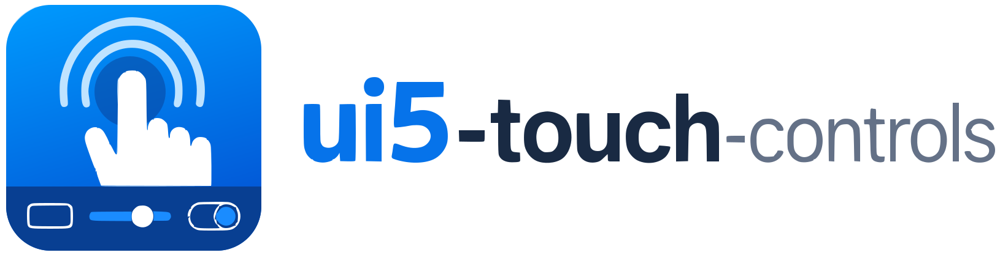
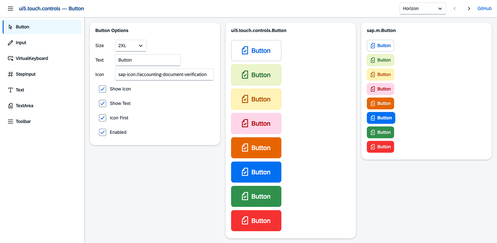
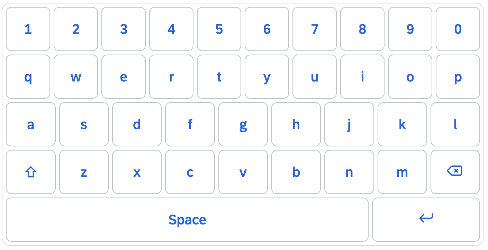
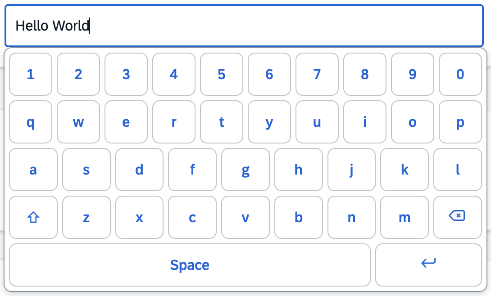
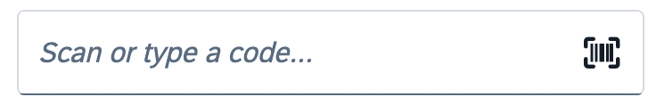
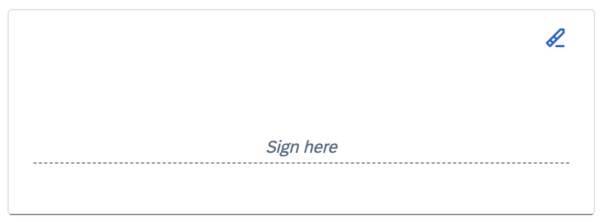
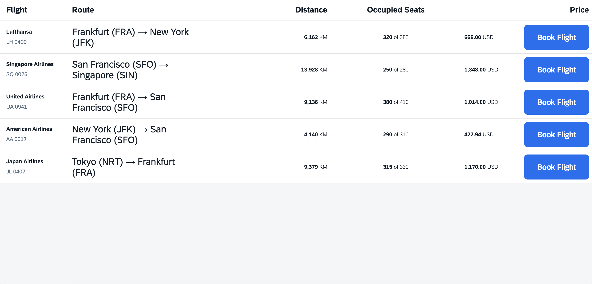
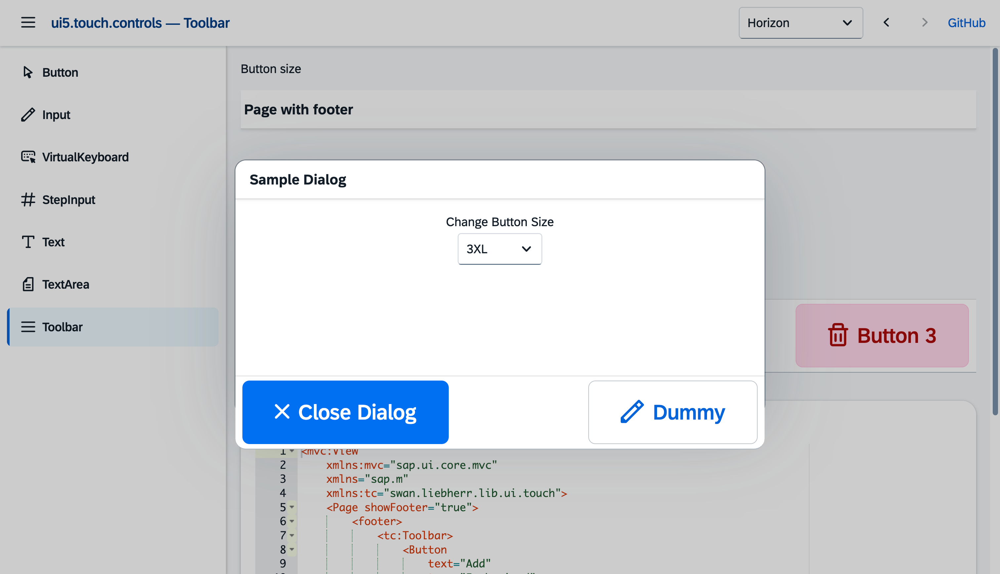

<p align="center">
<picture>
<source media="(prefers-color-scheme: dark)" srcset="assets/logo-dark.svg">

</picture>
</p>

<p align="center">
<a href="https://github.com/mariokernich/ui5-touch-controls/actions/workflows/ci.yml"></a>
<a href="https://github.com/mariokernich/ui5-touch-controls/actions/workflows/ci.yml"></a>
<a href="https://github.com/mariokernich/ui5-touch-controls/actions/workflows/ci.yml"></a>
</p>

<p align="center">
<strong>UI tests</strong><br>
<a href="https://github.com/mariokernich/ui5-touch-controls/actions/workflows/ci.yml"></a>
<a href="https://github.com/mariokernich/ui5-touch-controls/actions/workflows/ci.yml"></a>
<a href="https://github.com/mariokernich/ui5-touch-controls/actions/workflows/ci.yml"></a>
<a href="https://github.com/mariokernich/ui5-touch-controls/actions/workflows/ci.yml"></a>
<a href="https://github.com/mariokernich/ui5-touch-controls/actions/workflows/ci.yml"></a>
<a href="https://github.com/mariokernich/ui5-touch-controls/actions/workflows/ci.yml"></a>
</p>

**Standard UI5 controls, rebuilt for touch — plus the ones `sap.m` is missing.**

`sap.m` controls are made for mouse and keyboard. On a tablet, a shop floor terminal or a device operated with gloves they are simply too small — and the cozy content density only gets you one step further.

The library does two things about that:

1. **It rebuilds the most important `sap.m` controls** on their original structure and opens them up for sizing through one central `size` property (`S`–`6XL`) that works the same way on every control. You do not have to rebuild your app: the controls keep the familiar properties, aggregations and events of their originals for the common cases, so you can use them as a drop-in replacement — add the namespace, put `tc:` in front of the control, set a size. Everything else stays the way it is.

2. **It adds controls that `sap.m` does not have at all**, for situations that only come up on touch devices. The prime example is [`tc:Keyboard`](#new-controls-for-touch) — a terminal without a hardware keyboard needs an on-screen keyboard, and OpenUI5 does not ship one.



**Link of full documentation:** https://mariokernich.github.io/ui5-touch-controls/test-resources/ui5/touch/controls/index.html


## Drop-in replacement — before and after

A `sap.m.Page` with an `OverflowToolbar` as footer. This is the standard version:

```xml
<mvc:View
	xmlns:mvc="sap.ui.core.mvc"
	xmlns="sap.m">
	<Page title="Order">
		<footer>
			<OverflowToolbar>
				<Button text="Save" type="Emphasized" icon="sap-icon://save" press=".onSave" />
				<Button text="Cancel" icon="sap-icon://decline" press=".onCancel" />
				<ToolbarSpacer />
				<Button text="Approve" type="Accept" icon="sap-icon://accept" press=".onApprove" />
				<Button text="Reject" type="Reject" icon="sap-icon://decline" press=".onReject" />
				<Button text="History" icon="sap-icon://history" press=".onHistory" />
			</OverflowToolbar>
		</footer>
	</Page>
</mvc:View>
```

And the touch version — the namespace `tc`, a `tc:` in front of the controls and a `size`:

```xml
<mvc:View
	xmlns:mvc="sap.ui.core.mvc"
	xmlns="sap.m"
	xmlns:tc="ui5.touch.controls">
	<Page title="Order">
		<footer>
			<tc:OverflowToolbar size="XL">
				<tc:Button text="Save" type="Emphasized" icon="sap-icon://save" size="XL" press=".onSave" />
				<tc:Button text="Cancel" icon="sap-icon://decline" size="XL" press=".onCancel" />
				<ToolbarSpacer />
				<tc:Button text="Approve" type="Accept" icon="sap-icon://accept" size="XL" press=".onApprove" />
				<tc:Button text="Reject" type="Reject" icon="sap-icon://decline" size="XL" press=".onReject" />
				<tc:Button text="History" icon="sap-icon://history" size="XL" press=".onHistory" />
			</tc:OverflowToolbar>
		</footer>
	</Page>
</mvc:View>
```

Same aggregations, same properties, same event handlers — `press=".onSave"` still calls the same method in your controller. `sap.m` controls such as `ToolbarSpacer` can stay exactly where they are.

The result: buttons big enough to hit with a finger, and a toolbar that moves everything that does not fit behind a button with three dots.


Bind `size` to a model to switch the size of the whole app at runtime:

```xml
<tc:Button text="Save" size="{settings>/touchSize}" press=".onSave" />
```

## New controls for touch

Not everything a touch app needs exists in `sap.m`. Where that is the case, the library adds a control of its own — built from the same sized building blocks, themed through the same theme parameters, so it fits in with the rest.

### The keyboards

On a shop floor terminal, a kiosk or a device operated with gloves there is often no hardware keyboard, and the on-screen keyboard of the operating system is either unavailable or covers half the screen. OpenUI5 has no control for this. This library brings three, rendered from its own buttons — no third-party dependency, and sized through the same `size` property as everything else.

Which one you reach for follows from what the field is for:

| Control | What it is |
| --- | --- |
| `tc:Keyboard` | a keyboard of letters, built from a language and a handful of switches |
| `tc:NumberPad` | a pad of digits in three columns |
| `tc:CustomKeyboard` | the keyboard whose keys you hand over, row by row |

All three share a base class, `tc:KeyboardBase`. That is where the value, the sets of keys, shift and caps lock, the hardware keys, the size, the width and the docking live — so everything below about those applies to each of the three. It is also the type the `keyboard` aggregation of a field is typed to, so any of them fits in there.



A key would like to be as wide as it is tall — a square target under a thumb, and the width the keyboard brings along when nothing constrains it. That width is also the first thing to give: a keyboard is never scrolled sideways, so where the room is tight the keys share what there is instead. The height comes from `size` and stays as it is, so a key is as easy to hit as it was. Setting `width` on the keyboard has the same effect as a narrow screen.

#### `tc:Keyboard` — letters

`mode` is the arrangement of a country, named after the language rather than after the three letters in its top row:

| Mode | The arrangement of |
| --- | --- |
| `English` | QWERTY — the default |
| `German` | QWERTZ: Z and Y swapped, with Ä, Ö, Ü and ß |
| `French` | AZERTY: A and Q, Z and W swapped, M at the end of the home row |
| `Spanish` | QWERTY with an Ñ next to the L |
| `Italian` | QWERTY with the accented vowels on a set of their own |
| `Portuguese` | QWERTY with Ç, likewise with its accents on a set of their own |
| `Swedish` | Å, Ä and Ö at the end of the rows — what Finland writes on as well |
| `Turkish` | the Q arrangement, with the Turkish rules of case |
| `Romanian` | the standard arrangement, with the comma-below Ș and Ț |
| `Ukrainian` | ЙЦУКЕН with І, Ї and Є |
| `Russian` | ЙЦУКЕН with Ы, Э and Ъ |
| `Hindi` | Devanagari in the InScript arrangement, the Indian standard |

Turkish is worth a note: there i becomes İ and I becomes ı, which the ordinary change of case gets wrong. Portuguese and Italian write their accented vowels with a dead key on a keyboard of keys; a key that is tapped once has nowhere for a dead key to wait, so those letters sit on a set of their own, reached beside the space bar the way the digits are.

```xml
<tc:Keyboard
	value="{/article}"
	size="XL"
	mode="German"
	change=".onChange"
	enter=".onEnter" />
```

The rest of the keyboard is switches:

| Property | What it does |
| --- | --- |
| `displayNumbers` | where the digits go: `Always` in a row above the letters, `Toggle` behind a key of their own, `Never` not at all. `ToggleOnMobile` is the default — a row on a computer, a key on a phone |
| `showSpecialCharacters` | adds a set of brackets, signs and currencies |
| `showEmojis` | adds a set of faces behind a key of its own |
| `letterCase` | `Upper` or `Lower` pins the keyboard to one case and leaves shift and caps lock off — for a field with a case of its own, like a material number or a licence plate. `Mixed` is the default |
| `showCapsLock` | adds the caps lock beside the shift key |
| `showEscape` | adds an `{esc}` key as the first key of the top row |
| `enterText` | what the Enter key says — Search, Next. Empty leaves it the arrow it is |
| `extraKeys` | keys of your own beside the space bar, on every set |

`extraKeys` is where a key goes that a field wants at hand rather than behind a switch — the at sign of an address, the dot of a domain, a unit:

```xml
<tc:Keyboard
	value="{/email}"
	size="XL"
	mode="English"
	extraKeys="@,."
	enterText="Send" />
```

#### `tc:NumberPad` — digits

`mode` picks the block: `Simple` is the pad of a computer with 7 8 9 on top, `Phone` the pad of a telephone with 1 2 3 on top and a star and a hash beside the zero, `Calculator` adds the four basic operations and an equals sign.

```xml
<tc:NumberPad
	value="{/quantity}"
	size="XL"
	mode="Simple"
	showDecimalSeparator="true"
	change=".onChange" />
```

`decimalSeparator` says what that key writes; left empty it follows the current language — a comma in German, a point in English. `showSign` adds a minus for a value that may be negative. Both are only looked at in `Simple`: the other two blocks have their fourth row taken already. `showSpecialCharacters`, `showEscape` and `enterText` work as they do on the letters.

#### `tc:CustomKeyboard` — keys of your own

For anything the other two do not cover. `layout` is a list of rows, keys separated by spaces:

```xml
<tc:CustomKeyboard
	value="{/article}"
	size="XL"
	layout="A B C D, E F G H, {bksp} {space} {enter}" />
```

`{tab}`, `{shift}`, `{lock}`, `{space}`, `{bksp}`, `{esc}` and `{enter}` are the special keys; every other key inserts its own label into the value. `{shift}` writes the next letter in upper case and then falls away, `{lock}` is the caps lock and stays on until it is pressed again — and shift while the lock is on writes lower case, the way it does on a keyboard of keys.

##### More than one set of keys

A keyboard of keys has more on it than fits under ten fingers at once. A keyboard on a screen does what the one of a phone does instead: it shows one set at a time and swaps it for another when a key says so. Each set is a `tc:KeyboardLayout` with a `name` and its `rows`, and that is all there is to it — **every set stands on its own and says in full what is on it**. Upper case is not a state of the keyboard but a set of its own, written out as the letters it shows:

```xml
<tc:CustomKeyboard value="{/code}" size="XL">
	<tc:layouts>
		<tc:KeyboardLayout
			name="default"
			rows="q w e r t y u i o p,
			      a s d f g h j k l,
			      {shift} z x c v b n m {backspace},
			      {numbers} {space} {ent}" />
		<tc:KeyboardLayout
			name="shift"
			rows="Q W E R T Y U I O P,
			      A S D F G H J K L,
			      {shift} Z X C V B N M {backspace},
			      {numbers} {space} {ent}" />
		<tc:KeyboardLayout
			name="numbers"
			rows="1 2 3, 4 5 6, 7 8 9, {abc} 0 {backspace}" />
	</tc:layouts>
</tc:CustomKeyboard>
```

**A key named after a set switches to it**, so the switching is part of the layout and needs no code around it. A key that names the set it is already on leads back out of it, to whatever was there before — which is what makes the `{shift}` inside the set of capitals come back. The keyboard starts with the set called `default`, or with the first one when there is none by that name, and the value carries on across a switch: what was typed on the letters is still there on the digits.

The keys the control knows keep their own sign — `{shift}` is the key with the arrow whether it switches a set or not, `{bksp}` and `{enter}` are their icons, `{space}` says Space. The names that are conventional for a set have a text of their own as well: `{numbers}` reads 123, `{abc}` reads ABC, `{symbols}` reads #+=, `{accents}` reads áàâ and `{emojis}` is a face. A key that is none of these says what it is written as.

A layout written elsewhere can usually be used as it stands: `{backspace}`, `{ent}`, `{escape}` and `{capslock}` mean the same as `{bksp}`, `{enter}`, `{esc}` and `{lock}`, and `{abc}` leads back to `default` unless a set of that name exists.

##### What a key says

Every key the control knows comes with a sign of its own, and one it does not know says what it is written as. Where that is not the right text, the `display` aggregation puts one of your own on a key:

```xml
<tc:CustomKeyboard size="XL">
	<tc:display>
		<tc:KeyboardKey key="numbers" text="123" />
		<tc:KeyboardKey key="abc" text="ABC" />
		<tc:KeyboardKey key="ent" text="return" />
		<tc:KeyboardKey key="shift" text="⇧" />
	</tc:display>
</tc:CustomKeyboard>
```

It works on any key — a special one, a letter, a digit — and in every set of the keyboard. Note that the braces are left out: UI5 reads a string that begins with one as a binding, so `key="{numbers}"` would have to be escaped in a view. Both spellings mean the same key, and so do the other names of one: `ent` and `enter` are the same key.

The `layout` property is the short form of the same thing for a keyboard that only ever shows one set; a keyboard with `layouts` does not look at it.

#### Keys that stand out

`emphasizedKeys` names the keys that are drawn as emphasized — the one that ends what is being done, usually:

```xml
<tc:NumberPad size="XL" emphasizedKeys="enter,bksp" />
```

The braces are left out here too, for the same reason as in `display`. A modifier is emphasized while it is on whatever the property says, so a `{lock}` that is on still shows it.

#### Events

`change` reports the value after every key, `keyPress` the key itself, and `enter` the value when the Enter key is pressed. `escape` is fired by an `{esc}` key; the keyboard does nothing about it by itself and leaves to the application what it should mean — closing a dialog, clearing the field, going back:

```xml
<tc:CustomKeyboard
	value="{/code}"
	size="XL"
	layout="1 2 3, 4 5 6, 7 8 9, {esc} 0 {enter}"
	escape=".onEscape"
	enter=".onEnter" />
```

`maxLength` caps how much can be typed, and `hardwareKeys="true"` additionally accepts input from a real keyboard, which helps when the same screen runs both on a terminal and on a desktop.

#### On a field

The keyboard does not have to sit on the page. Put one into the `keyboard` aggregation of a `tc:Input` and switch `showKeyboard` on, and it opens in a popover below the field while the field has the focus:

```xml
<tc:Input
	value="{/quantity}"
	size="XL"
	showKeyboard="true">
	<tc:keyboard>
		<tc:Keyboard size="XL" />
	</tc:keyboard>
</tc:Input>
```



The keyboard types into the field: it is filled with the value of the field whenever the popover opens, every key fires `liveChange`, and its Enter key fires `change` and `submit` — the popover stays open, since the field still has the focus. `tc:TextArea` takes the same aggregation, where Enter adds a line break instead.

#### Docked

`docked` takes the keyboard out of the flow of the page and puts it at the bottom edge of the screen, over the content, the way the on-screen keyboard of a phone does. On a phone or a tablet it takes the full width of the screen and `width` is not looked at; from 1024px up it keeps its own width and is centered.

```xml
<tc:Keyboard
	value="{/code}"
	size="XL"
	mode="German"
	docked="true"
	change=".onChange" />
```

It works the same way on a field: put the keyboard in the `keyboard` aggregation as above and set `docked`, and the popover that carries it is docked instead of being placed at the field.

How high the keyboard reaches differs between the two, and that follows from where it sits. On a field it is carried into the static area by its popover, so it covers everything — a modal dialog included, which is what makes a field inside a dialog typeable. Standing on a page of its own it stays part of that page, and a page is a stacking context: it covers the content around it, but the block layer of a modal dialog still comes out on top.

One thing to watch in the app around it: `position: fixed` is measured against the screen only as long as no element on the way up creates a containing block of its own. `sap.tnt.ToolPage` does, with a `will-change: transform` on its content area — a docked keyboard inside one ends up pinned to that area instead of the screen. Setting `will-change: auto` on `.sapTntToolPageMain` in the application's own stylesheet is enough; it is what the demo of this library does.

### `tc:BarcodeInput`

On a shop floor or in a warehouse most input does not come from a keyboard but from a barcode scanner in keyboard wedge mode: it types the code into the focused field within a few milliseconds and closes it with <kbd>Enter</kbd>. A plain input cannot tell that apart from a person, so an application ends up reacting either to every <kbd>Enter</kbd> or to none.

`tc:BarcodeInput` measures the time between the keystrokes. A run of at least `minLength` characters whose gaps all stay below `scanTimeout` and that is closed by <kbd>Enter</kbd> fires `scan`; everything else is manual input and fires `change`:

```xml
<tc:BarcodeInput
	value="{/code}"
	placeholder="Scan a pallet..."
	size="XL"
	clearOnScan="true"
	scan=".onScan"
	change=".onManualEntry" />
```



So a scanned code can go straight to the backend while a typed one gets a confirmation first. `prefix` and `suffix` cut off the characters scanners put around the code.

### `tc:SignaturePad`

Handing over goods, confirming a repair or acknowledging a safety briefing all end with a signature, and on a tablet the natural place for it is the screen. `tc:SignaturePad` draws on a canvas and hands the result over as a PNG data URL in `value`, so it can be bound to a model and sent to the backend like any other value:

```xml
<tc:SignaturePad
	value="{/signature}"
	placeholder="Sign here"
	height="12rem"
	size="XL"
	change=".onSigned" />
```



Stroke width, placeholder and clear button follow the `size` property, and the pad keeps its strokes when it is resized.

## Requirements

- UI5 version **1.116 or higher** (OpenUI5 or SAPUI5)

1.116 is the oldest release the library runs on, and the test page is checked against it. What sets the limit is `sap/base/i18n/Localization`, which the `DatePicker` reads the language from and which does not exist before 1.116.

## Installation

The library is published on npm as [`ui5.touch.controls`](https://www.npmjs.com/package/ui5.touch.controls) and can be consumed in any UI5 application that is built with the [UI5 Tooling](https://sap.github.io/ui5-tooling/) (v3 or higher).

### 1. Install the package

Install the library as a **regular dependency** (not a `devDependency`) so the UI5 Tooling picks it up as a project dependency:

```sh
npm install ui5.touch.controls
```

```json
{
	"dependencies": {
		"ui5.touch.controls": "^1.3.1"
	}
}
```

The package ships a `ui5.yaml`, so the UI5 Tooling automatically resolves it as a library dependency.

#### With UI5 middleware (alternative setup)

Instead of consuming the library as a UI5 Tooling project dependency, you can serve it statically with [`ui5-middleware-servestatic`](https://www.npmjs.com/package/ui5-middleware-servestatic):

```sh
npm i ui5.touch.controls && npm i -D ui5-middleware-servestatic
```

Add the following configuration to your `ui5.yaml`:

```yaml
server:
  customMiddleware:
    - name: ui5-middleware-servestatic
      afterMiddleware: compression
      mountPath: /resources/ui5/touch/controls/
      configuration:
        npmPackagePath: 'ui5.touch.controls/dist/resources/ui5/touch/controls'
```

### 2. Declare the library in `manifest.json`

Add the library to the dependencies of your app:

```json
{
	"sap.ui5": {
		"dependencies": {
			"libs": {
				"ui5.touch.controls": {}
			}
		}
	}
}
```

### 3. Add the namespace to your views

```xml
<mvc:View
	xmlns:mvc="sap.ui.core.mvc"
	xmlns="sap.m"
	xmlns:tc="ui5.touch.controls">
	<tc:Button text="Hello" size="XL" />
</mvc:View>
```

### TypeScript support

For TypeScript projects, add the package to the `types` entry in your `tsconfig.json` — otherwise the UI5 Tooling will not load the library automatically:

```json
{
	"compilerOptions": {
		"types": [
			"@sapui5/types",
			"ui5.touch.controls"
		]
	}
}
```

The package includes TypeScript type definitions (`dist/index.d.ts`), so you get full typing out of the box:

```ts
import Button from "ui5/touch/controls/Button";
import { SizeMode } from "ui5/touch/controls/library";

const button = new Button({ text: "Confirm", size: SizeMode.XL });
```

## Controls

### Touch versions of `sap.m` controls

These are rebuilds of standard controls. They keep the properties, aggregations and events of their originals for the common cases, so they can be used as a drop-in replacement — the **Replaces** column names the control each one steps in for.

| Control | Replaces | Description |
| --- | --- | --- |
| `tc:Button` | `sap.m.Button` | Button with configurable size, icon, icon position, type (all `sap.m.ButtonType` values), side padding and width. Fires `press`. |
| `tc:SegmentedButton` | `sap.m.SegmentedButton` | A row of joined buttons of which exactly one is selected, filled through `tc:SegmentedButtonItem` (`key`, `text`, `icon`, `enabled`). Supports `selectedKey`, `width` for evenly spread segments and fires `selectionChange`. |
| `tc:CheckBox` | `sap.m.CheckBox` | Check box whose box, check mark, label and hit area scale together. Supports `selected`, `partiallySelected`, `text`, `editable`, `wrapping`, value states and `width`. Fires `select`. |
| `tc:RadioButton` / `tc:RadioButtonGroup` | `sap.m.RadioButton` / `sap.m.RadioButtonGroup` | Circle, dot, label and hit area scale together. Buttons sharing a `groupName` are mutually exclusive; the group arranges them in `columns` and hands its `size`, `enabled`, `editable` and value state down to them. Fires `select`. |
| `tc:Switch` | `sap.m.Switch` | Track, handle and label scale together, where `sap.m.Switch` is fixed at 4rem x 2rem. Supports `state`, `customTextOn`, `customTextOff` and the `AcceptReject` type. Fires `change`. |
| `tc:Select` | `sap.m.Select` | Drop-down filled with plain `sap.ui.core.Item` elements. The list opens in a popover whose rows are as big as the field, so they can be hit with a finger — the native list of `sap.m.Select` keeps its standard row height however large the field is. Supports `selectedKey`, `editable`, `forceSelection`, value states and `width`. On a phone the list takes the whole screen, as it does in `sap.m`, under the heading of `pickerTitle`. Fires `change`. |
| `tc:ComboBox` | `sap.m.ComboBox` | A `tc:Select` the user can type into: free text is allowed and what is typed filters the list, whose rows are as big as the field. Works together with the keyboards of this library on a device without a hardware keyboard. Supports `value`, `selectedKey`, `placeholder`, `editable`, value states, `width` and `showSecondaryValues`, which puts the `additionalText` of a `sap.ui.core.ListItem` at the end of a row. On a phone the list takes the whole screen under the heading of `pickerTitle` and brings a field of its own to go on typing in, as it does in `sap.m`. Fires `change` and `selectionChange`. |
| `tc:DatePicker` | `sap.m.DatePicker` | Field with a calendar built from the library's own buttons, so a day is a square that grows with `size` instead of the fixed grid of `sap.ui.unified.Calendar`. Days and months view, `minDate` / `maxDate`, `valueFormat` and `displayFormat`. Fires `change`. |
| `tc:TimePicker` | `sap.m.TimePicker` | Field with two columns of buttons — hours and minutes — so a time is picked with one tap on a target that grows with `size`, where `sap.m.TimePicker` uses a slider that has to be dragged. Supports `minutesStep`, `valueFormat` and `displayFormat`. Fires `change`. |
| `tc:Input` | `sap.m.Input` | Single-line input with configurable size. A keyboard can be put into its `keyboard` aggregation; with `showKeyboard` it then opens in a popover below the field while the field has the focus and types into it. |
| `tc:TextArea` | `sap.m.TextArea` | Multi-line input with configurable size, rows, max length and value states. Takes a keyboard in its `keyboard` aggregation just like `tc:Input` does; there the Enter key adds a line break. Fires `change` / `liveChange`. |
| `tc:Text` | `sap.m.Text` | Text with configurable size and color. Fires `press`. |
| `tc:Link` | `sap.m.Link` | Anchor with configurable size, so the area that can be hit with a finger grows with the label. Supports `href`, `target`, `wrapping`, `subtle`, `emphasized` and `width`; a `target="_blank"` link automatically gets `rel="noopener noreferrer"`. Fires `press`. |
| `tc:Toolbar` | `sap.m.Toolbar` | Toolbar container with a `content` aggregation. Usable in standard aggregations such as the footer of a `Page` or `Dialog`. |
| `tc:OverflowToolbar` | `sap.m.OverflowToolbar` | Like `tc:Toolbar`, but content that does not fit into the available width is moved behind a button with three dots which opens a popover with the remaining content. Understands the priorities of `sap.m.OverflowToolbarLayoutData`. |
| `tc:StepInput` | `sap.m.StepInput` | Minus button, input and plus button, sized together. Supports `min`, `max`, `step`. Fires `change`. |
| `QuickDialog` | `sap.m.MessageBox` | Helper class for touch-ready dialogs, used from the controller instead of a view: `show`, `confirm`, `information`, `error`, `input`, `select`, `details`. Every method returns a `Promise`. |

### Controls without a `sap.m` equivalent

These exist only in this library, for situations that only come up on a touch device — see [New controls for touch](#new-controls-for-touch) above for what they are good for.

| Control | Description |
| --- | --- |
| `tc:BarcodeInput` | Input field that tells a barcode scanner from a person typing: a run of at least `minLength` characters whose gaps stay below `scanTimeout` and that is closed by Enter fires `scan`, everything else fires `change`. `prefix` and `suffix` are cut off the code, `clearOnScan` empties the field for the next one. |
| `tc:Keyboard` | On-screen keyboard of letters, built from the library's own buttons. `mode` is the arrangement of a country (`English`, `German`, `French`, `Spanish`, `Italian`, `Portuguese`, `Swedish`, `Turkish`, `Romanian`, `Ukrainian`, `Russian`, `Hindi`); `displayNumbers`, `showSpecialCharacters`, `showEmojis`, `letterCase`, `showCapsLock`, `showEscape`, `enterText` and `extraKeys` say what else is on it. |
| `tc:NumberPad` | Pad of digits in three columns. `mode` picks the block (`Simple`, `Phone`, `Calculator`); `showDecimalSeparator`, `decimalSeparator`, `showSign` and `showSpecialCharacters` fill in the rest. |
| `tc:CustomKeyboard` | The keyboard whose keys are handed to it: `layout` for a single set of rows, the `layouts` aggregation of `tc:KeyboardLayout` for several that switch between each other, and `display` to say what a single key reads. |
| `tc:KeyboardBase` | Abstract base of the three. Carries `value`, `emphasizedKeys`, `maxLength`, `enabled`, `hardwareKeys`, `size`, `width` and `docked`, and fires `change` / `keyPress` / `enter` / `escape`. It is the type the `keyboard` aggregation of `tc:Input` and `tc:TextArea` takes, so any of the three fits in there. |
| `tc:SignaturePad` | A field to sign in with a finger or a stylus. Draws on a canvas and hands the signature over as a PNG data URL in `value`. Stroke width, placeholder and clear button follow `size`; the strokes survive a resize. Fires `change`. |

### Sizes

Every control has the same `size` property. Available values:

`S` · `M` (default) · `L` · `XL` · `2XL` · `3XL` · `4XL` · `5XL` · `6XL`

The size scales font size, icon size, padding and height together, so the controls stay proportional at every step.

### `ISized`

All controls with a `size` property implement the marker interface `ui5.touch.controls.ISized`. This allows generic size handling, e.g. to apply a user setting to a whole view:

```ts
if (control.isA<ISized>("ui5.touch.controls.ISized")) {
	control.setSize(SizeMode.XL);
}
```

### Theme compatibility

The library ships its own theme library for the following themes, so the controls take their colours, borders and shadows from the theme parameters of the active theme and blend in with the surrounding `sap.m` controls. Set the theme as usual through `data-sap-ui-theme` in the bootstrap or at runtime through `Theming.setTheme()`.

| Theme | Theme ID | Supported | Remark |
| --- | --- | --- | --- |
| Horizon | `sap_horizon` | ✅ | Default theme of the demo |
| Horizon Dark | `sap_horizon_dark` | ✅ | Dark variant of Horizon |
| Horizon High Contrast Black | `sap_horizon_hcb` | ✅ | High contrast, dark background |
| Horizon High Contrast White | `sap_horizon_hcw` | ✅ | High contrast, light background |
| Fiori 3 (Quartz Light) | `sap_fiori_3` | ✅ | Previous default theme of SAPUI5 / OpenUI5 |
| Fiori 3 Dark (Quartz Dark) | `sap_fiori_3_dark` | ✅ | Dark variant of Fiori 3 |

Themes that are not listed here are not shipped with the library. UI5 then falls back to the base theme for `ui5.touch.controls`, so the controls stay usable, but they will not match the colours of the rest of the application.

## More examples

The controls integrate seamlessly with existing standard controls and aggregations — for example `tc:Button` and `tc:Text` inside a `sap.m.Table`:



Use `tc:Toolbar` or `tc:OverflowToolbar` as a replacement for the toolbar in a `Page` or `Dialog`:



### ⚠️ Aggregations that only accept `sap.m.Button`

Some standard aggregations are typed to `sap.m.Button` and therefore cannot take a `tc:Button` at all — the most common ones are `buttons`, `beginButton` and `endButton` of `sap.m.Dialog`:

```xml
<!-- does NOT work — these aggregations only accept sap.m.Button -->
<Dialog title="Delete order">
	<buttons>
		<tc:Button text="Delete" type="Reject" size="XL" press=".onDelete" />
		<tc:Button text="Cancel" size="XL" press=".onCancel" />
	</buttons>
</Dialog>
```

UI5 rejects the control at runtime:

```
"Element ui5.touch.controls.Button#__button0" is not valid
for aggregation "buttons" of Element sap.m.Dialog#__dialog0
```

And these button slots are not meant to be resized either — they are laid out for the standard button height.

**The way around it is the `footer` aggregation.** It is typed to `sap.m.Toolbar` (available since UI5 1.110), and because `tc:Toolbar` and `tc:OverflowToolbar` extend `sap.m.Toolbar`, they fit straight in. The dialog then sizes its footer to the toolbar, so touch-sized buttons are rendered properly:

```xml
<!-- works — the footer takes any sap.m.Toolbar, so also the touch ones -->
<Dialog title="Delete order">
	<footer>
		<tc:OverflowToolbar size="XL">
			<tc:Button text="Delete" type="Reject" icon="sap-icon://delete" size="XL" press=".onDelete" />
			<ToolbarSpacer />
			<tc:Button text="Cancel" icon="sap-icon://decline" size="XL" press=".onCancel" />
		</tc:OverflowToolbar>
	</footer>
</Dialog>
```

Use `tc:OverflowToolbar` rather than `tc:Toolbar` whenever the dialog can get narrow — actions that no longer fit then move into the overflow popover instead of being cut off.

The same applies in a controller:

```ts
import Button from "ui5/touch/controls/Button";
import OverflowToolbar from "ui5/touch/controls/OverflowToolbar";
import { SizeMode } from "ui5/touch/controls/library";

dialog.setFooter(
	new OverflowToolbar({
		size: SizeMode.XL,
		content: [
			new Button({ text: "Delete", type: ButtonType.Reject, size: SizeMode.XL, press: onDelete }),
			new ToolbarSpacer(),
			new Button({ text: "Cancel", size: SizeMode.XL, press: onCancel }),
		],
	}),
);
```

For plain message-box style dialogs you do not have to build this yourself — `QuickDialog` already creates its footer this way, sized through its `size` option.

## Development

### Prerequisites

- Node.js ≥ 24
- [pnpm](https://pnpm.io/)

### Getting started

```sh
pnpm install
npm run start
```

This starts the dev server (`ui5 serve` with `ui5-docs.yaml`) and opens the demo application. The demo is a standalone UI5 app in `docs/`: `Component.ts` and `manifest.json` wire the router, `view/` holds one XML view per page and `controller/` the matching controllers. The shell (side navigation, theme switcher, previous/next) lives in `view/App.view.xml`, the page list in `model/pages.ts`. It always runs against the latest UI5.

### Test pages

`test/` holds a single plain page that shows every control — no descriptions, no navigation, no models, nothing but the controls, so a broken render is the library's doing and not the demo's. It exists to see the controls on the older UI5 versions the library supports:

```sh
npm run start:test          # latest
npm run start:test:1.116    # the oldest supported release
npm run start:test:1.120    # and 1.124, 1.130, 1.140
```

`#Button` in the hash — or `?control=Button` — narrows the page to a single control; without either, every control is shown, one section after the other. Switching by hash rebuilds the page without reloading it. The cases are built in `test/cases.ts`.

### UI tests

The same page is what the UI tests run against. They are written with [wdi5](https://ui5-community.github.io/wdi5/) (WebdriverIO plus the UI5 service), so the controls are addressed through the UI5 control tree and read back through their own getters:

```sh
npm run test:ui                        # the version pinned in ui5-test.yaml
UI5_VERSION=1.116.0 npm run test:ui    # any other release
```

`wdio.conf.js` starts the dev server itself, so there is nothing to have running beforehand. The suite checks that every control of `test/cases.ts` is on the page, that a CheckBox, a Switch, an Input and a Select still react, that a Button grows with its `size`, and that the page reports no error along the way.

The GitHub workflow `ci.yml` runs the suite on every supported UI5 release in parallel, next to the type check, the lint run and the build. The matrix is not a second list: `scripts/ui5-versions.mjs` reads it from the `start:test*` scripts in `package.json`, so a release is added to CI by adding the script for it.

The badges at the top of this file show one job of that workflow each, on `main`. They are looked up by the name of the job — `Types`, `Lint`, `Build`, `UI tests on UI5 1.116` — and the name has to match exactly, so renaming a job means changing its badge with it.

### Scripts

| Script | Description |
| --- | --- |
| `npm run start` | Start the local dev server with livereload and open the demo application |
| `npm run start:test` | Open the plain test page on the latest UI5 |
| `npm run start:test:1.116` | Same page on UI5 1.116, the oldest supported release |
| `npm run start:test:1.120` | Same page on UI5 1.120 (`:1.124`, `:1.130` and `:1.140` for the other supported versions) |
| `npm run build` | Build the library into `dist/` |
| `npm run build:demo` | Build of library and demo with preload bundles (used for the GitHub Pages deployment) |
| `npm run build:ts-interfaces` | Generate the `*.gen.d.ts` TypeScript interfaces for the controls |
| `npm run test:ui` | Run the wdi5 UI tests against the test page (`UI5_VERSION` picks the release) |
| `npm run check:ts` | TypeScript type check (`tsc --noEmit`) |
| `npm run check:lint` | ESLint check for `src`, `docs`, `test`, `e2e`, `scripts` and `wdio.conf.js` |
| `npm run build:icon-font` | Generate the library's icon font (TTF/WOFF/WOFF2 + metadata) from the SVGs in `src/icons` (runs automatically before start/build) |
| `npm run clean` | Remove `dist` and `coverage` |

### Project structure

```
src/                  Library sources (controls, library.ts, themes)
src/themes/           Base + theme-specific LESS files
docs/                 Demo application (Component, manifest, views, controllers)
test/                 Plain test page (one section per control)
e2e/                  wdi5 UI tests that run against the test page
scripts/              Build helper scripts
ui5.yaml              UI5 tooling config (library build)
ui5-docs.yaml         UI5 tooling config (dev server / demo application)
ui5-test.yaml         UI5 tooling config (test page, any UI5 version)
ui5-demo.yaml         UI5 tooling config (GitHub Pages build)
```

## Deployment

Pushes to `main` trigger the GitHub Actions workflow (`.github/workflows/deploy-pages.yml`), which builds the demo application with `npm run build:demo` and deploys it to GitHub Pages.

That build is `ui5 build --all`, and the `--all` is what matters: it writes a `library-preload.js` for every UI5 library the demo uses. Without them the browser asks for every single module — 181 requests before the first screen, 106 of them from `sap.m` alone. With them it is 48.

The demo's own files are bundled by `scripts/build-component-preload.mjs`, which runs right after the build. The UI5 tooling cannot do it here: its bundler reads from `/resources/` and writes to `/resources/`, while the demo of a library project lives in `/test-resources/`. The script writes the same `sap.ui.require.preload(...)` call the tooling would, so a page change costs one request instead of up to 54.

## License

Licensed under the [Apache License 2.0](LICENSE).
